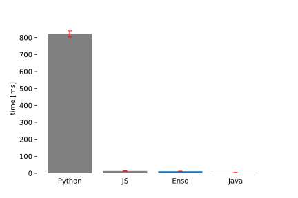
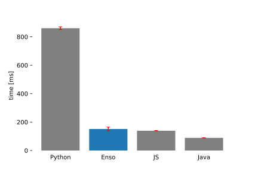
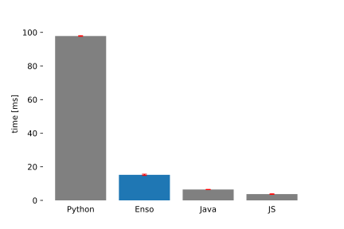
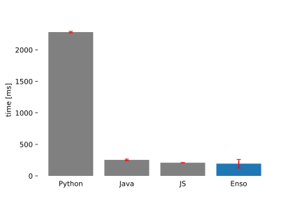
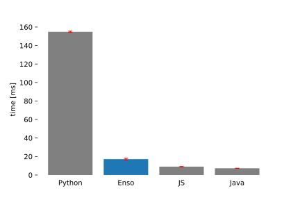
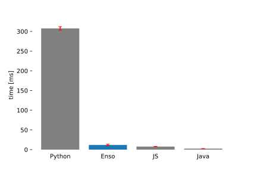
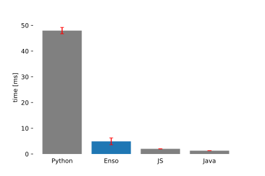

# Microbenchmarks

> This README is currently a work in progress.

This section describes the comparison of performance of Enso and other popular
languages (currently that includes Java, JS and Python).

## Results

Below follows a short description of each benchmark (including references to the
source code) and a presentation of its results.

### Sum

The goal of this benchmark is to measure the base performance of a loop with
arithmetic, by summing numbers from one to ten million.

The Enso implementation used tail recursion, as shown below.

```
sum : Integer -> Integer
sum n =
    go acc i =
        if i > n then acc else
            @Tail_Call go acc+i i+1
    res = go 0 1
    res
```

In other languages, this was implemented using a while loop. See the
implementations in
[Python](https://github.com/enso-org/benchmarks/blob/main/python/implementations.py#L1-L7),
[JS](https://github.com/enso-org/benchmarks/blob/main/js/implementations.js#L1-L9)
and
[Java](https://github.com/enso-org/benchmarks/blob/main/java/microbenchmarks/src/main/java/org/enso/microbenchmarks/Implementations.java#L5-L13).



<br/>

| Language | Time [ms] | Error [ms] |
| :------- | --------: | ---------: |
| Java     |   4.04504 |   0.000693 |
| Enso     |   11.3328 | 0.00967667 |
| JS       |     12.94 | 0.00392667 |
| Python   |   821.581 |    17.8992 |

> The error is approximated by computing the interval within which 99% of
> measurements fit.

<br/>

### Vector Allocation

This benchmark measures the time it takes to allocate a vector (a linear array)
and fill it with complex objects. The objects used in this and all following
benchmarks were 2-dimensional points represented using a simple structure (an
atom or a class, depending on a language).

The created vectors consist of one million elements.

```
type Point x y

alloc_vector : Integer -> Vector
alloc_vector n =
    Vector.new n (x -> Point x x)
```

See the implementations in
[Python](https://github.com/enso-org/benchmarks/blob/main/python/implementations.py#L9-L15),
[JS](https://github.com/enso-org/benchmarks/blob/main/js/implementations.js#L11-L24)
and Java
([the allocation function](https://github.com/enso-org/benchmarks/blob/main/java/microbenchmarks/src/main/java/org/enso/microbenchmarks/Implementations.java#L15-L22)
and the
[`Point` class](https://github.com/enso-org/benchmarks/blob/main/java/microbenchmarks/src/main/java/org/enso/microbenchmarks/Point.java)).



<br/><br/>

| Language | Time [ms] | Error [ms] |
| :------- | --------: | ---------: |
| Java     |   88.9622 |   0.467679 |
| JS       |   139.051 |    1.55461 |
| Enso     |   151.249 |    13.4023 |
| Python   |   860.448 |    9.79263 |

<br/>

### Vector Sum

This benchmark measures the time it takes to sum elements of a vector. The
vector is the same as created by the benchmark above - it computes `Point`s and
the sum of both of their coordinates is computed.

```
sum_vector : Vector -> Integer
sum_vector vec =
    go acc i =
        if i >= vec.length then acc else
            v = vec.at i
            @Tail_Call go (acc + v.x + v.y) i+1
    res = go 0 0
    res
```

See the implementations in
[Python](https://github.com/enso-org/benchmarks/blob/main/python/implementations.py#L17-L21),
[JS](https://github.com/enso-org/benchmarks/blob/main/js/implementations.js#L26-L34)
and
[Java](https://github.com/enso-org/benchmarks/blob/main/java/microbenchmarks/src/main/java/org/enso/microbenchmarks/Implementations.java#L24-L31).



<br/><br/>

| Language | Time [ms] | Error [ms] |
| :------- | --------: | ---------: |
| JS       |   3.73833 |   0.160482 |
| Java     |   6.48289 |   0.079613 |
| Enso     |   15.2125 |   0.404855 |
| Python   |   97.8382 |   0.188951 |

<br/>

### List Allocation

This benchmark measures the time it takes to allocate a linked list data
structure containing complex objects (the same `Point` structure is used as in
the previous benchmarks).

The created lists consist of one million elements.

```
type List
    type Cons head tail
    type Nil

alloc_list : Integer -> List
alloc_list n =
    go acc n =
        if n == 0 then Cons (Point 0 0) acc else
            @Tail_Call go (Cons (Point n n) acc) n-1
    res = go Nil n
    res
```

In other languages the list is implemented as a structure containing the head
and a pointer to the tail and the empty list is represented as `null` (or `None`
in case of Python) to avoid, usually more expensive, `instanceof` checks. See
the implementations in
[Python](https://github.com/enso-org/benchmarks/blob/main/python/implementations.py#L23-L32),
[JS](https://github.com/enso-org/benchmarks/blob/main/js/implementations.js#L36-L49)
and Java
([the allocation function](https://github.com/enso-org/benchmarks/blob/main/java/microbenchmarks/src/main/java/org/enso/microbenchmarks/Implementations.java#L33-L39)
and the
[`Cons` class](https://github.com/enso-org/benchmarks/blob/main/java/microbenchmarks/src/main/java/org/enso/microbenchmarks/Cons.java)).



<br/><br/>

| Language | Time [ms] | Error [ms] |
| :------- | --------: | ---------: |
| Enso     |   194.425 |    67.7076 |
| JS       |   208.974 |    1.25082 |
| Java     |   254.009 |    13.0299 |
| Python   |   2283.15 |    11.6015 |

<br/>

### List Sum

This benchmark measures the time it takes to sum elements of a linked list as
created above (it is analogous to the Vector Sum benchmark). It checks the
general performance of list traversal.

```
sum_list : List -> Integer
sum_list list =
    go acc list = case list of
        Nil -> acc
        Cons h t ->
            @Tail_Call go acc+h.x+h.y t
    res = go 0 list
    res
```

See the implementations in
[Python](https://github.com/enso-org/benchmarks/blob/main/python/implementations.py#L34-L40),
[JS](https://github.com/enso-org/benchmarks/blob/main/js/implementations.js#L51-L59)
and
[Java](https://github.com/enso-org/benchmarks/blob/main/java/microbenchmarks/src/main/java/org/enso/microbenchmarks/Implementations.java#L41-L48).



<br/><br/>

| Language | Time [ms] | Error [ms] |
| :------- | --------: | ---------: |
| Java     |   7.26603 |   0.070526 |
| JS       |   9.04733 |   0.137573 |
| Enso     |   17.1443 |   0.928918 |
| Python   |   154.862 |   0.646967 |

<br/>

### Full Binary Tree Allocation

This benchmark measures the time it takes to allocate a full binary tree.

This one and its corresponding summing benchmark compare the performance of
creating and traversing more complex data structures using non-tail recursion
(because in the other benchmarks mostly relied on while-loops in imperative
languages and tail-recursion in Enso). Of course it is possible to avoid
recursion in these examples, for example by simulating a stack, but the
recursive solution is the most natural one here.

It also shows an example of using mutable `State` to keep track of the indexes
in each node and shows that Enso's `State` monad has comparable performance to
regular mutable state of other languages.

The allocated trees have a depth of 17, which means that they consist of 2^17 =
131072 elements (including the leafs).

```
type Tree
    type Leaf
    type Node left elem right

alloc_full_tree : Integer -> Tree
alloc_full_tree depth =
    go remaining_depth =
        if remaining_depth == 0 then Leaf else
            l = go remaining_depth-1
            i = State.get Integer
            State.put Integer i+1
            e = Point i i
            r = go remaining_depth-1
            Node l e r
    res = State.run Integer 0 <| go depth
    res
```

In other languages, the leaf is represented as `null` (or `None`), similarly as
explained in [List Allocation](#list-allocation). The state is implemented using
a mutable variable within the closure of a helper function (in case of Python
and JS) and using mutable member elements within a helper class (in case of
Java). See the implementations in
[Python](https://github.com/enso-org/benchmarks/blob/main/python/implementations.py#L42-L60),
[JS](https://github.com/enso-org/benchmarks/blob/main/js/implementations.js#L61-L83)
and Java
([the allocator](https://github.com/enso-org/benchmarks/blob/main/java/microbenchmarks/src/main/java/org/enso/microbenchmarks/Implementations.java#L50-L78)
and the
[`Tree` class](https://github.com/enso-org/benchmarks/blob/main/java/microbenchmarks/src/main/java/org/enso/microbenchmarks/Tree.java)).



<br/><br/>

| Language | Time [ms] | Error [ms] |
| :------- | --------: | ---------: |
| Java     |   2.49132 |    0.05542 |
| JS       |    7.7585 |    0.28599 |
| Enso     |    11.822 |    1.88513 |
| Python   |   307.699 |    4.37348 |

<br/>

### Tree Sum

This benchmark measures the time it takes to sum elements of a binary tree. It
checks the performance of traversal of more complex data structures and
recursion.

```
sum_tree : Tree -> Integer
sum_tree tree = case tree of
    Leaf -> 0
    Node l e r -> here.sum_tree l + e.x + e.y + here.sum_tree r
```

See the implementations in
[Python](https://github.com/enso-org/benchmarks/blob/main/python/implementations.py#L62-L68),
[JS](https://github.com/enso-org/benchmarks/blob/main/js/implementations.js#L85-L94)
and
[Java](https://github.com/enso-org/benchmarks/blob/main/java/microbenchmarks/src/main/java/org/enso/microbenchmarks/Implementations.java#L80-L88).



<br/><br/>

| Language | Time [ms] | Error [ms] |
| :------- | --------: | ---------: |
| Java     |   1.29162 |   0.012507 |
| JS       |    2.0155 |   0.042925 |
| Enso     |     4.911 |    1.31693 |
| Python   |   47.9598 |    1.23146 |

<br/>

## Additional Notes

Language implementations used for each benchmark:

- Enso 0.2.10-SNAPSHOT
- Java OpenJDK 11.0.10
- NodeJS v15.12.0
- Python 3.8.5

The benchmarks were run on an Amacon EC2 m5.xlarge instance, running Ubuntu
Server 20.04 LTS.

Each benchmark for Enso has been ran in a separate fork of the JVM and multiple
warmup iterations have been performed to ensure that the JIT optimizations were
triggered. Benchmark iterations were being run in groups of 50 and a time
measurement was done before and after each group. This was done to increase the
precision of measurements for benchmarks that run in very short time. The final
time was computed by averaging these group averages over a set of 25 iterations
(excluding 25 warmup iterations). The errors are computed by taking the 0.005th
and 0.995th quantile and ensuring that the 99% of values lie within the `error`
of the computed average. Moreover, timing of a function that just sleeps for
10ms has been benchmarked to verify empirically the error of time measurements.
After warmup, the error was much less than 1ms so it should not affect the
results significantly.

A very similar approach was done for JavaScript (since the NodeJS runtime also
does just in time optimizations) - here also each benchmark was run in a
separate fork and 25 warmup and 25 regular iterations in groups of 50 were
performed.

For Java, the preferred Java Microbenchmark Harness was used. There were 10
warmup iterations that take 10s each and 10 measurement iterations taking 5s,
each benchmark was executed in 3 separate fork. Here the timings of each
measurement iteration are again averaged and the error is estimated using a
standard error estimator with 99.9% confidence.

Python benchmarks are similarily timed in groups, each group consists of 10
iterations and 20 groups were run. These benchmarks run in a single fork and
skip warmup, because CPython does not do any JIT optimizations, so this should
not affect the results. The amount of iterations was smaller than Enso or JS
because the benchmarks for Python took more time, so the groups could be smaller
and there was no need for additional warmup iterations.

In all the languages, the Garbage Collector was triggered between each group of
iterations, to minimize the impact of garbage collection on the timing.

## How To Run The Benchmarks

To run the benchmarks yourself you need to ensure that the dependencies as
[described above](#additional-notes) are installed and that the following
executables are available on your system PATH: `enso`, `java`, `python3` and
`node`.

The automated script is tailored to Linux but it should also work on macOS,
possibly with minor modifications.

Enso can be downloaded from
[the releases page](https://github.com/enso-org/enso/releases). It is best to
download the `enso-bundle-...` package for your operating system, unpack it and
install using `./bin/enso install distribution --bundle-install-mode=copy` which
should place `enso` on your PATH, at least for standard configurations which
include `~/.local/bin` in the PATH. For non-standard configurations, it may need
to be added manually.

You may need to modify the`enso-version` in
[`enso/microbenchmarks/package.yaml`](./enso/microbenchmarks/package.yaml) to
match the version that you have downloaded.

Alternatively, if you want to use exactly the same version as was used in the
benchmarks, you can checkout
[the relevant commit](https://github.com/enso-org/enso/commit/444ae39d2872ef2b05ff58b71e500a81be13aac8),
set it up as explained
[in the documentation](https://github.com/enso-org/enso/blob/444ae39d2872ef2b05ff58b71e500a81be13aac8/docs/CONTRIBUTING.md)
and build using
`sbt "runtime/clean; buildEngineDistribution; buildLauncherDistribution; makeBundles"`.

If you are running Ubuntu 20.04 LTS, Python and Java can be installed using
`apt install python3 openjdk-11-jre`. To install the specified NodeJS version we
recommend using [`nvm`](https://github.com/nvm-sh/nvm#installing-and-updating).

# Enso-R vs Gnu-R

TODO
