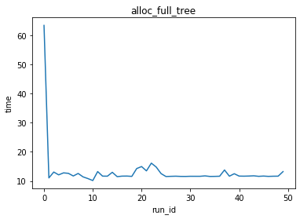
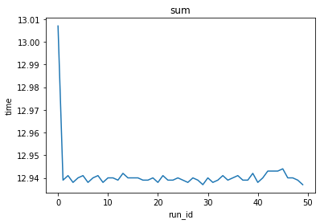

The code is available at https://github.com/enso-org/benchmarks/

The benchmarks were run on an Amacon EC2 `m5.xlarge` instance, running Ubuntu 20 and the following software (see results/versions.txt for details):
- Enso 0.2.10-SNAPSHOT (latest pre-release build)
- Java 11 (openjdk)
- Node.js v15.12.0
- Python 3.8.5

## Loading results


```python
results_dir = "./results/"
```


```python
import pandas as pd
import os
import seaborn as sns
from matplotlib import pyplot as plt
```


```python
os.listdir(results_dir)
```


    ['enso.csv', 'versions.txt', 'js.csv', 'java.csv', 'python.csv']


```python
python = pd.read_csv(results_dir + "python.csv", skipinitialspace=True)
```


```python
java = pd.read_csv(results_dir + "java.csv")
```


```python
js = pd.read_csv(results_dir + "js.csv", skipinitialspace=True)
```

## Unifying formats


```python
# Java benchmarks are run using JMH, we rename the columns a bit to our format
def from_jmh(df, lang):
    df = df.copy()
    df = df[["Benchmark", "Score", "Score Error (99.9%)"]] \
          .rename(columns={"Benchmark": "benchmark", "Score": "time", "Score Error (99.9%)": "error"})
    df["benchmark"] = df["benchmark"].str.split('.').str[-1]
    df["language"] = lang
    df.set_index(["benchmark", "language"], inplace=True)
    return df
```


```python
java_df = from_jmh(java, "java")
java_df
```


<div>
<style scoped>
    .dataframe tbody tr th:only-of-type {
        vertical-align: middle;
    }

    .dataframe tbody tr th {
        vertical-align: top;
    }

    .dataframe thead th {
        text-align: right;
    }
</style>
<table border="1" class="dataframe">
  <thead>
    <tr style="text-align: right;">
      <th></th>
      <th></th>
      <th>time</th>
      <th>error</th>
    </tr>
    <tr>
      <th>benchmark</th>
      <th>language</th>
      <th></th>
      <th></th>
    </tr>
  </thead>
  <tbody>
    <tr>
      <th>alloc_full_tree</th>
      <th>java</th>
      <td>2.491321</td>
      <td>0.055420</td>
    </tr>
    <tr>
      <th>alloc_list</th>
      <th>java</th>
      <td>254.008887</td>
      <td>13.029932</td>
    </tr>
    <tr>
      <th>alloc_vector</th>
      <th>java</th>
      <td>88.962189</td>
      <td>0.467679</td>
    </tr>
    <tr>
      <th>sum</th>
      <th>java</th>
      <td>4.045041</td>
      <td>0.000693</td>
    </tr>
    <tr>
      <th>sum_list</th>
      <th>java</th>
      <td>7.266030</td>
      <td>0.070526</td>
    </tr>
    <tr>
      <th>sum_tree</th>
      <th>java</th>
      <td>1.291624</td>
      <td>0.012507</td>
    </tr>
    <tr>
      <th>sum_vector</th>
      <th>java</th>
      <td>6.482886</td>
      <td>0.079613</td>
    </tr>
  </tbody>
</table>
</div>


```python
enso = pd.read_csv(results_dir + "enso.csv")
```

Let's see how the warm-up profile of Enso's JIT looks like:


```python
def plot_warm(df):
    plt.figure(figsize=(10, 8))
    sns.lineplot(data=df, x="run_id", y="time", hue="benchmark")
    plt.legend(loc="upper right")
    plt.show()
    for b in df["benchmark"].unique():
        part = df[df["benchmark"] == b]
        plt.title(b)
        sns.lineplot(data=part, x="run_id", y="time")
        plt.show()
```


```python
plot_warm(enso)
```





In our format we compute the mean time and approximate the error by looking at the distribution of timings. If our error is `x`, that means that 99% of the timings lie within `mean +- x`.


```python
def aggregate_my(df, lang):
    agg = df.groupby("benchmark")["time"]
    df2 = pd.DataFrame({"low": agg.mean() - agg.quantile(0.005), "hi": agg.quantile(0.995) - agg.mean()})
    err = df2[["low", "hi"]].max(axis=1)
    df2 = pd.DataFrame({"time": agg.mean(), "error": err, "language": lang})
    df2 = df2.reset_index().set_index(["benchmark", "language"])
    return df2
```

We set warmup cutoff at 25, as it is a moment when all benchmarks are pretty well warmed up, but we still have a lot of samples 25 runs, which is 50 iterations each.


```python
warmup_cutoff = 25
```


```python
enso_df = aggregate_my(enso[enso["run_id"] > warmup_cutoff], "enso")
enso_df
```


<div>
<style scoped>
    .dataframe tbody tr th:only-of-type {
        vertical-align: middle;
    }

    .dataframe tbody tr th {
        vertical-align: top;
    }

    .dataframe thead th {
        text-align: right;
    }
</style>
<table border="1" class="dataframe">
  <thead>
    <tr style="text-align: right;">
      <th></th>
      <th></th>
      <th>time</th>
      <th>error</th>
    </tr>
    <tr>
      <th>benchmark</th>
      <th>language</th>
      <th></th>
      <th></th>
    </tr>
  </thead>
  <tbody>
    <tr>
      <th>10ms</th>
      <th>enso</th>
      <td>10.063250</td>
      <td>0.002520</td>
    </tr>
    <tr>
      <th>alloc_full_tree</th>
      <th>enso</th>
      <td>11.822042</td>
      <td>1.885133</td>
    </tr>
    <tr>
      <th>alloc_list</th>
      <th>enso</th>
      <td>194.425042</td>
      <td>67.707577</td>
    </tr>
    <tr>
      <th>alloc_vector</th>
      <th>enso</th>
      <td>151.248542</td>
      <td>13.402263</td>
    </tr>
    <tr>
      <th>sum</th>
      <th>enso</th>
      <td>11.332792</td>
      <td>0.009677</td>
    </tr>
    <tr>
      <th>sum_list</th>
      <th>enso</th>
      <td>17.144292</td>
      <td>0.928918</td>
    </tr>
    <tr>
      <th>sum_tree</th>
      <th>enso</th>
      <td>4.911000</td>
      <td>1.316925</td>
    </tr>
    <tr>
      <th>sum_vector</th>
      <th>enso</th>
      <td>15.212500</td>
      <td>0.404855</td>
    </tr>
  </tbody>
</table>
</div>


```python
plot_warm(js)
```





We can see that JS actually warms up very quickly and has rather stable performance (the plots show a lot of variance but that is because the Y axis is scaled, in fact looking at the Y axis we can see that this is just very low-amplitued noise, as can be seen from the table below).


```python
js_df = aggregate_my(js[js["run_id"] > warmup_cutoff], "js")
js_df
```


<div>
<style scoped>
    .dataframe tbody tr th:only-of-type {
        vertical-align: middle;
    }

    .dataframe tbody tr th {
        vertical-align: top;
    }

    .dataframe thead th {
        text-align: right;
    }
</style>
<table border="1" class="dataframe">
  <thead>
    <tr style="text-align: right;">
      <th></th>
      <th></th>
      <th>time</th>
      <th>error</th>
    </tr>
    <tr>
      <th>benchmark</th>
      <th>language</th>
      <th></th>
      <th></th>
    </tr>
  </thead>
  <tbody>
    <tr>
      <th>10ms</th>
      <th>js</th>
      <td>10.061625</td>
      <td>0.001260</td>
    </tr>
    <tr>
      <th>alloc_full_tree</th>
      <th>js</th>
      <td>7.758500</td>
      <td>0.285990</td>
    </tr>
    <tr>
      <th>alloc_list</th>
      <th>js</th>
      <td>208.974333</td>
      <td>1.250817</td>
    </tr>
    <tr>
      <th>alloc_vector</th>
      <th>js</th>
      <td>139.051125</td>
      <td>1.554610</td>
    </tr>
    <tr>
      <th>sum</th>
      <th>js</th>
      <td>12.939958</td>
      <td>0.003927</td>
    </tr>
    <tr>
      <th>sum_list</th>
      <th>js</th>
      <td>9.047333</td>
      <td>0.137573</td>
    </tr>
    <tr>
      <th>sum_tree</th>
      <th>js</th>
      <td>2.015500</td>
      <td>0.042925</td>
    </tr>
    <tr>
      <th>sum_vector</th>
      <th>js</th>
      <td>3.738333</td>
      <td>0.160482</td>
    </tr>
  </tbody>
</table>
</div>


```python
pydf = aggregate_my(python, "python")
```


```python
cmp = pd.concat([pydf, js_df, java_df, enso_df]).reset_index()
cmp
```


<div>
<style scoped>
    .dataframe tbody tr th:only-of-type {
        vertical-align: middle;
    }

    .dataframe tbody tr th {
        vertical-align: top;
    }

    .dataframe thead th {
        text-align: right;
    }
</style>
<table border="1" class="dataframe">
  <thead>
    <tr style="text-align: right;">
      <th></th>
      <th>benchmark</th>
      <th>language</th>
      <th>time</th>
      <th>error</th>
    </tr>
  </thead>
  <tbody>
    <tr>
      <th>0</th>
      <td>10ms</td>
      <td>python</td>
      <td>10.060493</td>
      <td>0.002125</td>
    </tr>
    <tr>
      <th>1</th>
      <td>alloc_full_tree</td>
      <td>python</td>
      <td>307.699224</td>
      <td>4.373478</td>
    </tr>
    <tr>
      <th>2</th>
      <td>alloc_list</td>
      <td>python</td>
      <td>2283.146443</td>
      <td>11.601534</td>
    </tr>
    <tr>
      <th>3</th>
      <td>alloc_vector</td>
      <td>python</td>
      <td>860.448023</td>
      <td>9.792626</td>
    </tr>
    <tr>
      <th>4</th>
      <td>sum</td>
      <td>python</td>
      <td>821.580576</td>
      <td>17.899173</td>
    </tr>
    <tr>
      <th>5</th>
      <td>sum_list</td>
      <td>python</td>
      <td>154.861527</td>
      <td>0.646967</td>
    </tr>
    <tr>
      <th>6</th>
      <td>sum_tree</td>
      <td>python</td>
      <td>47.959800</td>
      <td>1.231461</td>
    </tr>
    <tr>
      <th>7</th>
      <td>sum_vector</td>
      <td>python</td>
      <td>97.838201</td>
      <td>0.188951</td>
    </tr>
    <tr>
      <th>8</th>
      <td>10ms</td>
      <td>js</td>
      <td>10.061625</td>
      <td>0.001260</td>
    </tr>
    <tr>
      <th>9</th>
      <td>alloc_full_tree</td>
      <td>js</td>
      <td>7.758500</td>
      <td>0.285990</td>
    </tr>
    <tr>
      <th>10</th>
      <td>alloc_list</td>
      <td>js</td>
      <td>208.974333</td>
      <td>1.250817</td>
    </tr>
    <tr>
      <th>11</th>
      <td>alloc_vector</td>
      <td>js</td>
      <td>139.051125</td>
      <td>1.554610</td>
    </tr>
    <tr>
      <th>12</th>
      <td>sum</td>
      <td>js</td>
      <td>12.939958</td>
      <td>0.003927</td>
    </tr>
    <tr>
      <th>13</th>
      <td>sum_list</td>
      <td>js</td>
      <td>9.047333</td>
      <td>0.137573</td>
    </tr>
    <tr>
      <th>14</th>
      <td>sum_tree</td>
      <td>js</td>
      <td>2.015500</td>
      <td>0.042925</td>
    </tr>
    <tr>
      <th>15</th>
      <td>sum_vector</td>
      <td>js</td>
      <td>3.738333</td>
      <td>0.160482</td>
    </tr>
    <tr>
      <th>16</th>
      <td>alloc_full_tree</td>
      <td>java</td>
      <td>2.491321</td>
      <td>0.055420</td>
    </tr>
    <tr>
      <th>17</th>
      <td>alloc_list</td>
      <td>java</td>
      <td>254.008887</td>
      <td>13.029932</td>
    </tr>
    <tr>
      <th>18</th>
      <td>alloc_vector</td>
      <td>java</td>
      <td>88.962189</td>
      <td>0.467679</td>
    </tr>
    <tr>
      <th>19</th>
      <td>sum</td>
      <td>java</td>
      <td>4.045041</td>
      <td>0.000693</td>
    </tr>
    <tr>
      <th>20</th>
      <td>sum_list</td>
      <td>java</td>
      <td>7.266030</td>
      <td>0.070526</td>
    </tr>
    <tr>
      <th>21</th>
      <td>sum_tree</td>
      <td>java</td>
      <td>1.291624</td>
      <td>0.012507</td>
    </tr>
    <tr>
      <th>22</th>
      <td>sum_vector</td>
      <td>java</td>
      <td>6.482886</td>
      <td>0.079613</td>
    </tr>
    <tr>
      <th>23</th>
      <td>10ms</td>
      <td>enso</td>
      <td>10.063250</td>
      <td>0.002520</td>
    </tr>
    <tr>
      <th>24</th>
      <td>alloc_full_tree</td>
      <td>enso</td>
      <td>11.822042</td>
      <td>1.885133</td>
    </tr>
    <tr>
      <th>25</th>
      <td>alloc_list</td>
      <td>enso</td>
      <td>194.425042</td>
      <td>67.707577</td>
    </tr>
    <tr>
      <th>26</th>
      <td>alloc_vector</td>
      <td>enso</td>
      <td>151.248542</td>
      <td>13.402263</td>
    </tr>
    <tr>
      <th>27</th>
      <td>sum</td>
      <td>enso</td>
      <td>11.332792</td>
      <td>0.009677</td>
    </tr>
    <tr>
      <th>28</th>
      <td>sum_list</td>
      <td>enso</td>
      <td>17.144292</td>
      <td>0.928918</td>
    </tr>
    <tr>
      <th>29</th>
      <td>sum_tree</td>
      <td>enso</td>
      <td>4.911000</td>
      <td>1.316925</td>
    </tr>
    <tr>
      <th>30</th>
      <td>sum_vector</td>
      <td>enso</td>
      <td>15.212500</td>
      <td>0.404855</td>
    </tr>
  </tbody>
</table>
</div>


Looking at the `10ms` benchmark which is just 'sleep for 10ms' we can see that the resolution of time measurements is satisfactory.


```python
cmp["benchmark"].unique()
```


    array(['10ms', 'alloc_full_tree', 'alloc_list', 'alloc_vector', 'sum',
           'sum_list', 'sum_tree', 'sum_vector'], dtype=object)


```python
for b in cmp["benchmark"].unique():
    part = cmp[cmp["benchmark"] == b]
    print(part)
    if b == "10ms":
        continue
    plt.bar(x=part["language"], height=part["time"], yerr=part["error"])
    plt.title(b)
    plt.show()
```

       benchmark language       time     error
    0       10ms   python  10.060493  0.002125
    8       10ms       js  10.061625  0.001260
    23      10ms     enso  10.063250  0.002520
              benchmark language        time     error
    1   alloc_full_tree   python  307.699224  4.373478
    9   alloc_full_tree       js    7.758500  0.285990
    16  alloc_full_tree     java    2.491321  0.055420
    24  alloc_full_tree     enso   11.822042  1.885133


         benchmark language         time      error
    2   alloc_list   python  2283.146443  11.601534
    10  alloc_list       js   208.974333   1.250817
    17  alloc_list     java   254.008887  13.029932
    25  alloc_list     enso   194.425042  67.707577


           benchmark language        time      error
    3   alloc_vector   python  860.448023   9.792626
    11  alloc_vector       js  139.051125   1.554610
    18  alloc_vector     java   88.962189   0.467679
    26  alloc_vector     enso  151.248542  13.402263


       benchmark language        time      error
    4        sum   python  821.580576  17.899173
    12       sum       js   12.939958   0.003927
    19       sum     java    4.045041   0.000693
    27       sum     enso   11.332792   0.009677


       benchmark language        time     error
    5   sum_list   python  154.861527  0.646967
    13  sum_list       js    9.047333  0.137573
    20  sum_list     java    7.266030  0.070526
    28  sum_list     enso   17.144292  0.928918


       benchmark language       time     error
    6   sum_tree   python  47.959800  1.231461
    14  sum_tree       js   2.015500  0.042925
    21  sum_tree     java   1.291624  0.012507
    29  sum_tree     enso   4.911000  1.316925


         benchmark language       time     error
    7   sum_vector   python  97.838201  0.188951
    15  sum_vector       js   3.738333  0.160482
    22  sum_vector     java   6.482886  0.079613
    30  sum_vector     enso  15.212500  0.404855


```python
ratios = []
for b in cmp["benchmark"].unique():
    if b == "10ms":
        continue
    part = cmp[cmp["benchmark"] == b]
    ts = part.set_index("language")["time"]
    py = ts.loc["python"] / ts.loc["enso"]
    java = ts.loc["enso"] / ts.loc["java"]
    js = ts.loc["enso"] / ts.loc["js"]
    ratios.append({"benchmark": b, "python/enso": py, "enso/java": java, "enso/js": js})
ratios = pd.DataFrame.from_records(ratios)
ratios
```


<div>
<style scoped>
    .dataframe tbody tr th:only-of-type {
        vertical-align: middle;
    }

    .dataframe tbody tr th {
        vertical-align: top;
    }

    .dataframe thead th {
        text-align: right;
    }
</style>
<table border="1" class="dataframe">
  <thead>
    <tr style="text-align: right;">
      <th></th>
      <th>benchmark</th>
      <th>enso/java</th>
      <th>enso/js</th>
      <th>python/enso</th>
    </tr>
  </thead>
  <tbody>
    <tr>
      <th>0</th>
      <td>alloc_full_tree</td>
      <td>4.745290</td>
      <td>1.523754</td>
      <td>26.027588</td>
    </tr>
    <tr>
      <th>1</th>
      <td>alloc_list</td>
      <td>0.765426</td>
      <td>0.930378</td>
      <td>11.743068</td>
    </tr>
    <tr>
      <th>2</th>
      <td>alloc_vector</td>
      <td>1.700144</td>
      <td>1.087719</td>
      <td>5.688967</td>
    </tr>
    <tr>
      <th>3</th>
      <td>sum</td>
      <td>2.801651</td>
      <td>0.875798</td>
      <td>72.495869</td>
    </tr>
    <tr>
      <th>4</th>
      <td>sum_list</td>
      <td>2.359513</td>
      <td>1.894955</td>
      <td>9.032833</td>
    </tr>
    <tr>
      <th>5</th>
      <td>sum_tree</td>
      <td>3.802190</td>
      <td>2.436616</td>
      <td>9.765791</td>
    </tr>
    <tr>
      <th>6</th>
      <td>sum_vector</td>
      <td>2.346563</td>
      <td>4.069327</td>
      <td>6.431435</td>
    </tr>
  </tbody>
</table>
</div>


